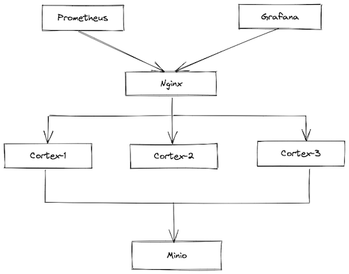
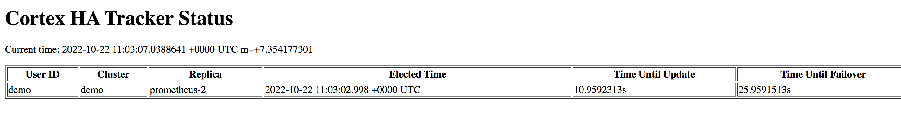
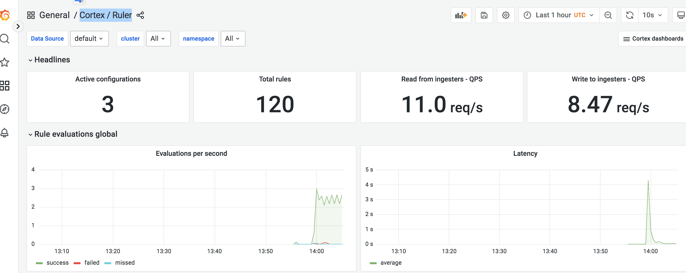

# Play With Cortex

[Cortex](https://github.com/cortexproject/cortex) is a distributed, horizontally scalable, and highly available long term storage for Prometheus.

This lessons will help you to learn Cortex step by step like playing a game. thanks to [play-with-mimir](https://github.com/grafana/mimir/tree/main/docs/sources/tutorials/play-with-grafana-mimir) for this idea.

## Prerequisites

- Git
- Docker and Docker Compose
- Availability of both ports 9000、9002、9090、3000、8001～8003 on your host machine

## Download resources

1. Clone repo to your local with git

```
git clone https://github.com/tsclub/play-with-cortex.git
```

2. Change to specific lesson

```
cd play-with-cortex
git fetch origin 
git checckout lesson1 // or change to other lesson{number}
docker-compose up -d
```

3. Release all Docker resources after test

```
docker-compose down
```

## Step by step

### Lesson 1

In this Lesson, you'll learn how to run Cortex cluster local with Docker Compose.

<details>
  <summary>Click me</summary>

Start running your local setup with the following Docker command:

```
git checkout lesson1
docker-compose up -d
```

This command starts:

- Cortex
    - Three instances of monolithic-mode Cortex to provide high availability
    - Multi-tenancy enabled (tenant ID is demo)
- Minio
    - S3-compatible persistent storage for blocks, rules, and alerts.
- Prometheus
    - Scrapes all Cortex metrics, then writes them back to Cortex to ensure availability of ingested metrics.
- Grafana
    - Includes a preinstalled datasource to query Cortex.
    - Includes preinstalled dashboards for monitoring Cortex.
- Load balancer
    - A simple NGINX-based load balancer that exposes Cortex endpoints on the host.

The diagram will like:



The following ports will be exposed on the host:

- Grafana on [http://localhost:3000](http://localhost:3000)
- Cortex on [http://localhost:8001~8003](http://localhost:8001)
- Minio on [http://localhost:9002](http://localhost:9002), super account is `cortex/supersecret`
- Prometheus on [http://localhost:9090](http://localhost:9090)
</details>

### Lesson 2

In this Lesson, you'll learn how to use Cortex distributor's HATracker.

<details>
  <summary>Click me</summary>
  
You can run test with command:

```
git checkout lesson2
docker-compose up -d
```

When you visit [http://localhost:8001/distributor/ha_tracker](http://localhost:8001/distributor/ha_tracker), you will see HATracker workes.



If you stop `prometheus-2`, about 30s later it will auto change master to `prometheus-1`.

#### The changes

Change `cortex.yaml` to enable HATracker

```
limits:
  accept_ha_samples: true

distributor:
    ha_tracker:
    enable_ha_tracker: true
    kvstore:
        store: consul
        consul:
        host: consul:8500
```

Note: HATracker's KV store only support consul and etcd, so we use consul here.

Update `docker-compose.yaml` to add consul dependence.

```
services:
  consul:
    image: consul
    command: [ "agent", "-dev" ,"-client=0.0.0.0", "-log-level=info" ]
    ports:
      - 8500:8500
```

We need another Prometheus like existed one

```
 prometheus-2:
    image: prom/prometheus:v2.39.1
    command: ["--config.file=/etc/prometheus/prometheus.yaml", "--enable-feature=expand-external-labels", "--log.level=debug"]
    environment:
      PODNAME: prometheus-2
    volumes:
      - ./config/prometheus:/etc/prometheus
      - data-prometheus-2:/prometheus
    ports:
      - 9091:9090
```

And add `ha_cluster_label` and `ha_replica_label` labels to `prometheus.yaml`

```
global:
  external_labels:
    cluster: demo
    __replica__: ${PODNAME} 
```

Note: `ha_cluster_label` default value is `cluster`, `ha_replica_label` is `__replica__`. you can configurate to another with `limits_config`.

</details>

### Lesson 3

In this Lesson, you'll learn how to enable record rules with cortex's ruler.

<details>
  <summary>Click me</summary>
  
You can run test with command:

```
git checkout lesson3
docker-compose up -d
```

After started, we use `curl` command to create some record rules

```
$ curl -X POST -H 'X-Scope-OrgID: demo' -H 'content-type:application/yaml' --data-binary "@./config/cortex/rules/cortex_api_1.yaml"  http://localhost:8001/api/v1/rules/cortex


{"status":"success","data":null,"errorType":"","error":""}
```

If you want to create all cortex related record rules, run `sh bin/rules.sh` please, after that we can check them with Cortex API

```
$ curl -H 'X-Scope-OrgID: demo' http://localhost:8001/api/v1/rules
```

At last we can go to `Cortex/Ruler` Grafana dashboard to check ruler running status.



#### The changes

We change Prometheus to Agent mode with `--enable-feature=agent` flag and remove the `rule_files` configuration from `prometheus.yaml` 

Update `cortex.yaml` to enable ruler with default sharding

```
ruler:
  enable_api: true
  enable_sharding: true
  poll_interval: 2s
  ring:
    kvstore:
      store: memberlist
```

</details>
